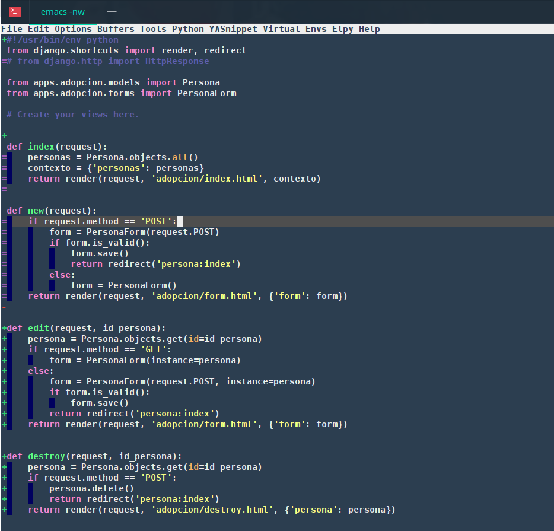

# Emacs - REPOSITORY #

**Requisitos del Sistema**
    * Sistema Operativo Linux 
    * emacs >=26


    
### Paquetes ###
Para que funcione correctamente debera tener instalado los siguientes paquetes:

```bash
sudo apt-get install silversearcher-ag
sudo apt-get install xclip
sudo apt-get install python-pip
sudo pip install setuptools
sudo pip install elpy jedi flake8 importmagic autopep8 yapf epc
sudo apt-get install elpa-projectile
sudo apt-get install markdown
sudo npm install -g eslint
sudo apt-get install php-cli
sudo apt-get install cscope
```

### Instalación ###

1.- Clonar el proyecto

```bash
git clone https://github.com/bandagriss/emacs-repository.git
```

2.- Reemplazar los archivos

```bash
rm ~/.emacs
rm -rf ~/.emacs.d
cp emacs ~/.emacs
cp -rf emacs.d ~/.emacs.d
```

3.- Opcional
Si esta trabajando con zsh agregar esto al archivo .zshrc

```bash
[[ -s $HOME/.nvm/nvm.sh ]] && . $HOME/.nvm/nvm.sh
```

*Creado por Roy*
